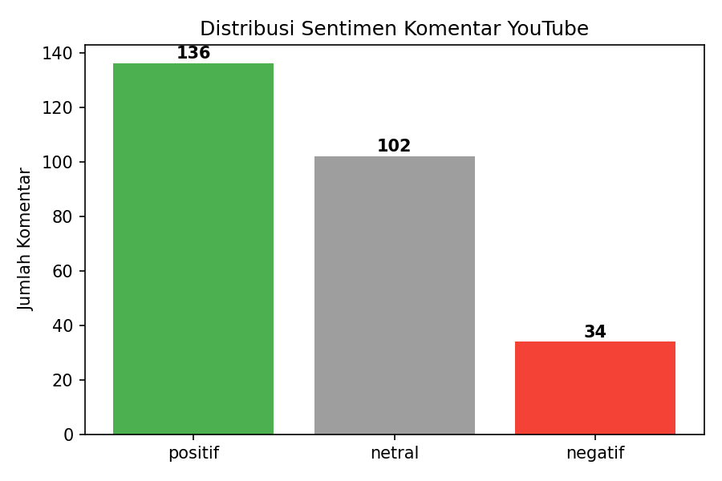

# ScrappingYoutube Suara Berkelas
# SentiTube 🎬💬

**Scrape & analisis sentimen komentar YouTube secara otomatis — tanpa perlu API key.**

SentiTube adalah kumpulan script Python untuk mengambil (scrape) komentar dari video YouTube, membersihkan teksnya, lalu mengklasifikasikan sentimennya (positif/netral/negatif) menggunakan pendekatan lexicon-based Bahasa Indonesia — lengkap dengan deteksi emoji, normalisasi kata gaul, dan visualisasi hasil (bar chart & wordcloud).

---

## ✨ Fitur

- 🔍 **Scraping komentar YouTube** — dua metode: via YouTube Data API v3 (resmi) atau tanpa API key sama sekali
- 📥 **Scraping banyak video sekaligus** dari daftar URL
- 🧠 **Analisis sentimen Bahasa Indonesia** — lexicon-based dengan:
  - Normalisasi kata gaul/slang (`gk`, `bgt`, `gw`, dll → bentuk baku)
  - Stemming & stopword removal pakai [Sastrawi](https://github.com/sastrawi/sastrawi)
  - Deteksi kata negasi (`tidak bagus` ≠ `bagus`)
  - Deteksi sentimen dari **emoji** (❤️😍👍 vs 😢😡👎)
- 📊 **Visualisasi hasil** — bar chart distribusi sentimen & wordcloud kata populer (positif/negatif)
- 📁 Output rapi dalam format **CSV**, siap dianalisis lebih lanjut di Excel/Google Sheets

---

## 📂 Struktur Project

```
SentiTube/
├── scrape_komentar_youtube.py       # Scraping via YouTube Data API v3 (butuh API key)
├── scrape_komentar_tanpa_api.py     # Scraping tanpa API key (1 video)
├── scrape_banyak_video.py           # Scraping tanpa API key (banyak video sekaligus)
├── segmentasi_sentimen_lengkap.py   # Analisis & segmentasi sentimen + wordcloud
├── requirements.txt
└── README.md
```

---

## 🚀 Instalasi

Clone repo ini:
```bash
git clone https://github.com/username/SentiTube.git
cd SentiTube
```

Install dependency:
```bash
pip install -r requirements.txt
```

Atau install manual sesuai kebutuhan:
```bash
pip install pandas Sastrawi matplotlib wordcloud youtube-comment-downloader google-api-python-client
```

---

## 🛠️ Cara Pakai

### 1. Scraping Komentar

**Opsi A — Tanpa API key (paling mudah, 1 video)**

Edit `VIDEO_URL` di `scrape_komentar_tanpa_api.py`, lalu jalankan:
```bash
python scrape_komentar_tanpa_api.py
```

**Opsi B — Tanpa API key (banyak video sekaligus)**

Edit list `VIDEO_URLS` di `scrape_banyak_video.py`, lalu jalankan:
```bash
python scrape_banyak_video.py
```

**Opsi C — Via YouTube Data API v3 (resmi, butuh API key)**

1. Buat API key di [Google Cloud Console](https://console.cloud.google.com/) → aktifkan **YouTube Data API v3**
2. Isi `API_KEY` dan `VIDEO_ID` di `scrape_komentar_youtube.py`
3. Jalankan:
```bash
python scrape_komentar_youtube.py
```

Hasil scraping tersimpan dalam file `.csv` berisi kolom `author`, `comment`, `votes`/`likeCount`, `time`, dll.

### 2. Analisis Sentimen

Edit `INPUT_FILE` di `segmentasi_sentimen_lengkap.py` sesuai nama file CSV hasil scraping kamu, lalu jalankan:
```bash
python segmentasi_sentimen_lengkap.py
```

Output yang dihasilkan:
| File | Keterangan |
|------|------------|
| `hasil_segmentasi_sentimen.csv` | Data lengkap + kolom `sentimen` (positif/netral/negatif) |
| `grafik_sentimen.png` | Bar chart distribusi sentimen |
| `wordcloud_positif.png` | Kata populer di komentar positif |
| `wordcloud_negatif.png` | Kata populer di komentar negatif |

---

## 📸 Contoh Output

<!-- Ganti dengan screenshot asli setelah dijalankan -->
```
=== RINGKASAN SENTIMEN ===
Positif   : 136 komentar (50.0%)
Netral    : 102 komentar (37.5%)
Negatif   : 34 komentar (12.5%)
```



---

## ⚙️ Konfigurasi Kamus Sentimen

Kamus kata positif/negatif dan daftar slang bisa disesuaikan langsung di dalam `segmentasi_sentimen_lengkap.py` pada variabel:
- `KATA_POSITIF` / `KATA_NEGATIF` — kata-kata sentimen dasar
- `KAMUS_SLANG` — normalisasi kata gaul
- `EMOJI_POSITIF` / `EMOJI_NEGATIF` — daftar emoji yang dihitung sebagai sinyal sentimen

Cocokkan kamus ini dengan topik/niche video kamu supaya hasil klasifikasi lebih akurat.

---

## ⚠️ Disclaimer

- Script `scrape_komentar_tanpa_api.py` dan `scrape_banyak_video.py` mengambil data langsung dari halaman YouTube (bukan API resmi). Gunakan secukupnya, jangan scraping berlebihan dalam waktu singkat untuk menghindari rate-limit dari YouTube.
- Untuk penggunaan produksi/komersial, disarankan pakai `scrape_komentar_youtube.py` yang berbasis YouTube Data API v3 resmi.
- Analisis sentimen menggunakan pendekatan lexicon-based (rule-based), bukan machine learning — cocok untuk eksplorasi cepat, namun punya keterbatasan akurasi dibanding model NLP terlatih.

---

## 🧩 Rencana Pengembangan (Roadmap)

- [ ] Analisis sentimen per video (bandingkan performa antar video)
- [ ] Ekspor laporan otomatis ke Excel dengan grafik terintegrasi
- [ ] Dukungan model sentiment analysis berbasis machine learning/IndoBERT
- [ ] Dashboard interaktif (Streamlit) untuk eksplorasi hasil

---

## 📄 Lisensi

Proyek ini dirilis dengan lisensi MIT — bebas digunakan, dimodifikasi, dan didistribusikan.

---

## 🙌 Kontribusi

Pull request dan saran perbaikan kamus sentimen sangat terbuka! Silakan buat *issue* atau *pull request* kalau ada ide pengembangan.
